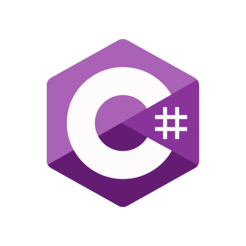

# AutosLocosTP
Proyecto de un juego de autos

Ventanas: 
registro de usuario
inicio de usuario
un menu
el propio juego
tabla de puntuaciones
administrador

Ventanas si o si :
registro de usuario
inicio de usuario
juego

Usuarios: 
administrador
jugador

si hacemos el juego del auto necesita estar sumandopuntosconstantemente hasta que pierda es mas simple que los obstaculos vengan hacia el jugador
de esta manera el jugador es estatico. al momento de perder se guarda el puntaje si esta entre los X mejores y se regresa al menu (idealmente tendria que 
poder volver a jugar sin ir al menu pero por ahora es mas simple que vuelva al menu). las opciones del menu tienen que ser jugar, tabla de puntuaciones y desconectarse.
para la base de datos se necesitan 2 tablas, una de usuarios y otra de puntuaciones.

por ahora el menu pueden ser simplemente botones y un texto al lado diciendo que hace
basicamente todos los botones hacen lo mismo redirigen a otra ventana el primero y el ultimo (jugar y desconectarte) abre la nueva ventana y cerrar la anterior
la de puntajes no tiene que cerrar la ventana de menu.

la de inicio es con la que empieza el programa con un boton que lo redirige a la de registro si no tiene usuario (mismo funcionamiento que los botones anteriores)
